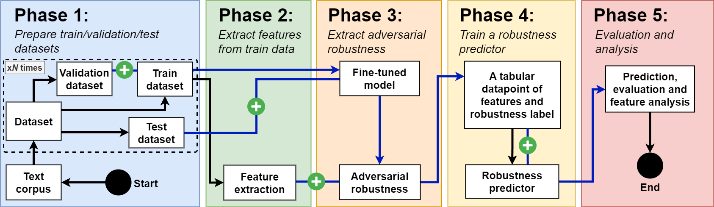

# RobustText_ACL2024
The official repository our ACL Findings 2024 paper: "[A Curious Case of Searching for the Correlation between Training Data and Adversarial Robustness of Transformer Textual Models](https://arxiv.org/abs/2402.11469)".



## Installation
```shell
pip install .
```

## Prepare Datasets
```shell
bash prepare_datasets.sh
```

## Generate Features of Fine-tuned Data and their corresponding Attack Success Rates
```shell
bash gen_data.sh
```

## Extract Insights
```shell
python data_analyze_inter.py
python data_analyze_extra.py
python compare_experiment.py
python data_train_visualize.py
python error_analysis.py
```